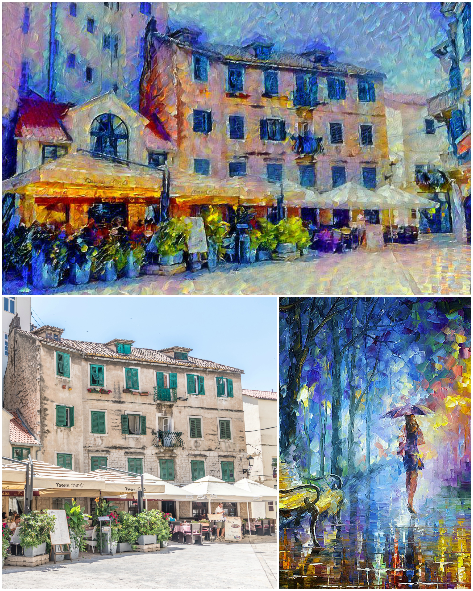
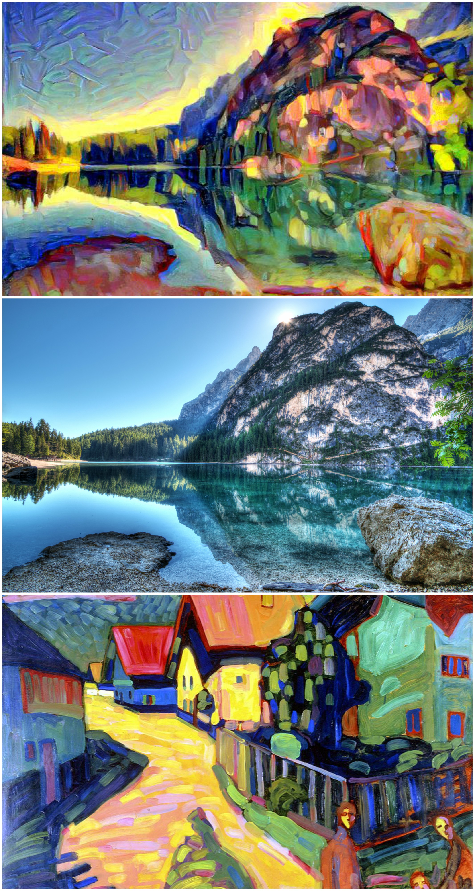
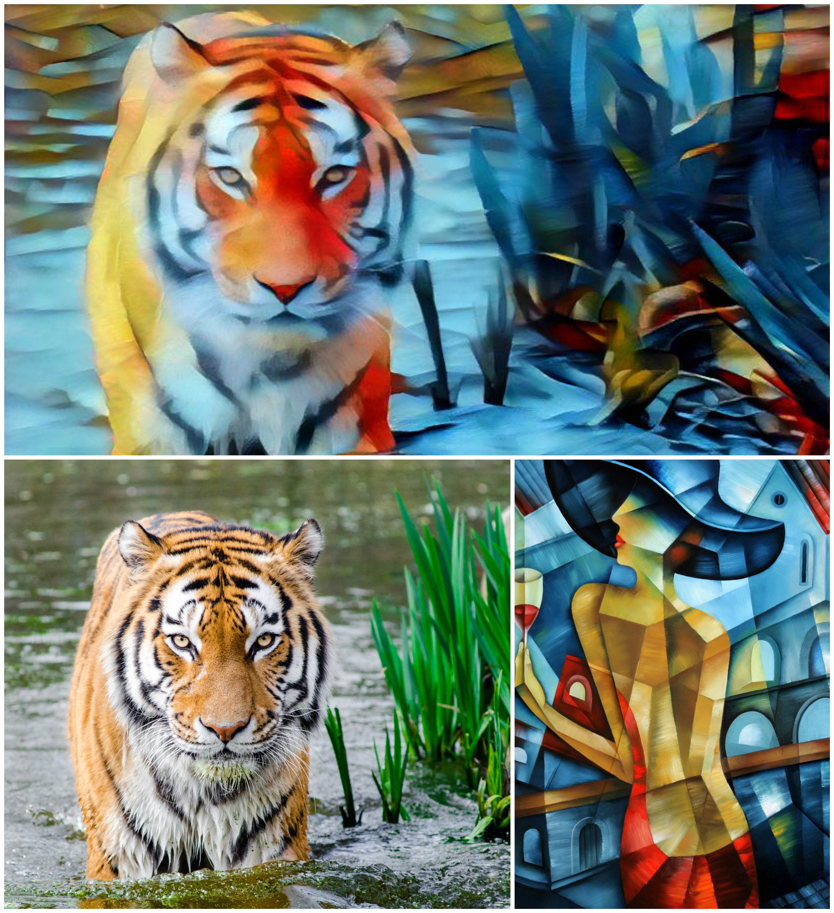
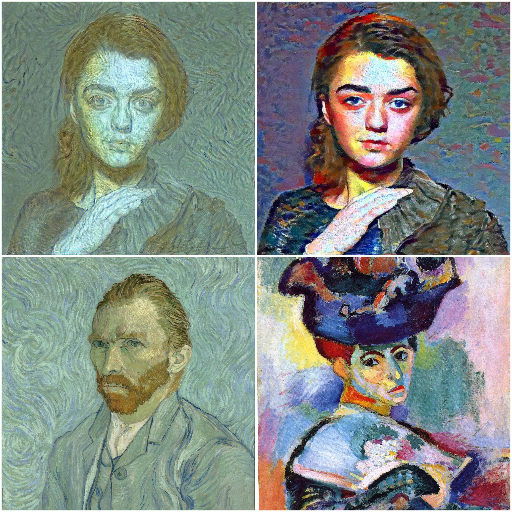

# Neural Style Transfer
With [@ankmathur96](https://github.com/ankmathur96)

This is a PyTorch implementation of the paper [A Neural Algorithm of Artistic Style](https://arxiv.org/abs/1508.06576) with some alterations that we came up with and others based off [Exploring the Neural Algorithm of Artistic Style](https://arxiv.org/abs/1602.07188).

The paper uses the outputs from running images through convolutional neural networks to create an image that matches the content profile of an image and uses the style profile of another image to create an image that displays the content of the first image in the style of the other.

### Usage
In the input folder, create images of the format `content_dataset-name.jpg` and `style_dataset-name.jpg`. In the code, set the dataset name.

`python3 neural.py`

### Results

